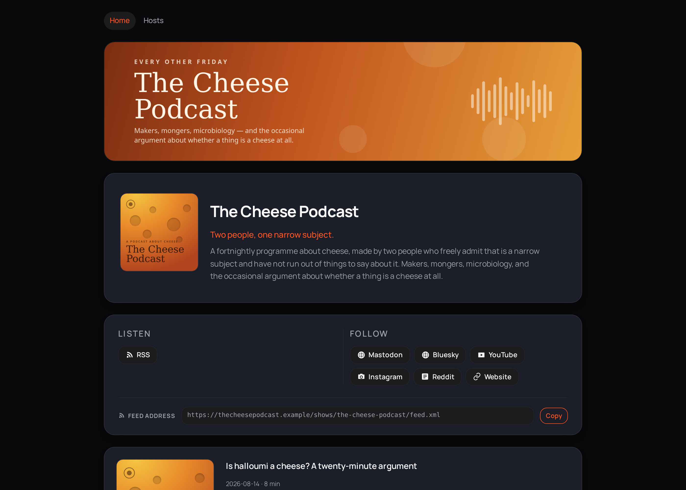
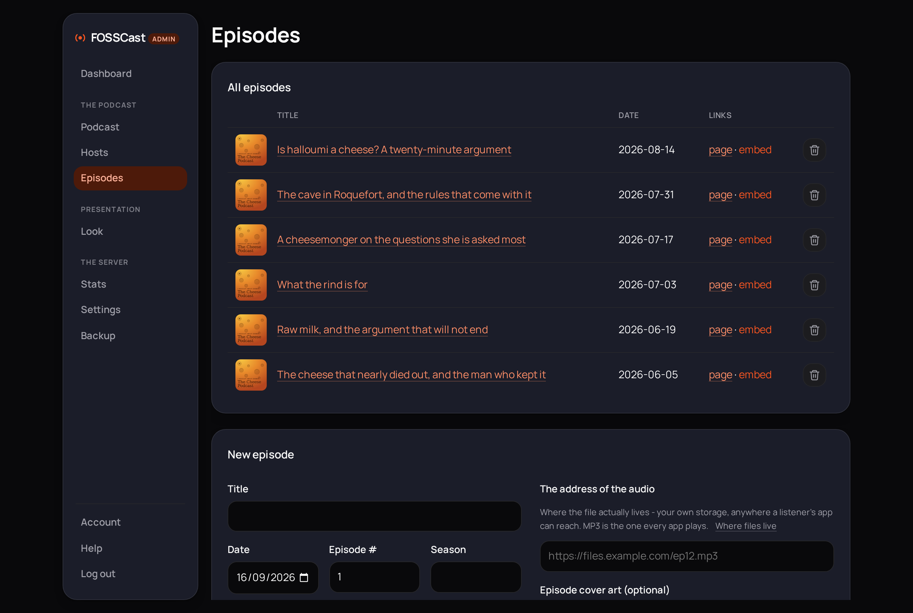
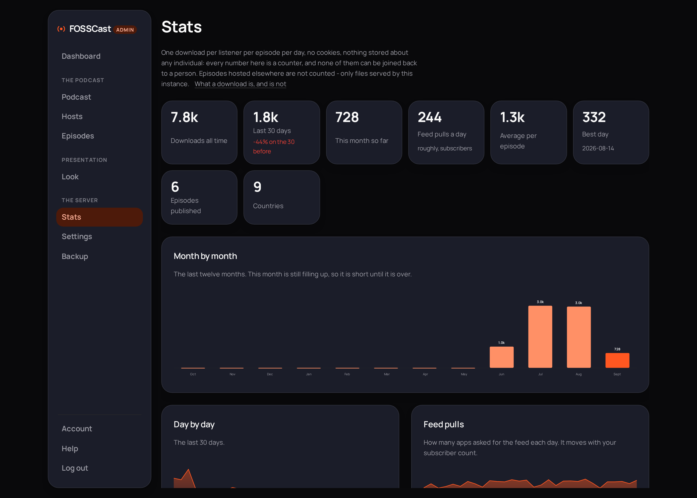

# FOSSCast

**A home for your podcast on your own server.** Every episode gets a page, a player and a feed that any podcast app can subscribe to, with honest download numbers and nothing tracking anybody. One file to install, and it is yours.



[fosscast.org](https://fosscast.org) &middot; [Install](#install) &middot; [What you get](#what-you-get) &middot; [AGPL-3.0](LICENSE)

## Install

One file, nothing in it to fill in. Save [`docker-compose.pull.yml`](docker-compose.pull.yml) as `docker-compose.yml` on a Linux server with Docker, point your domain at the machine, then:

```bash
docker compose up -d
```

Open it in a browser. The first person to open a FOSSCast nobody owns claims it: you set an email and a password, and add a passkey and a second factor in the same minute if you want them. There is no code to find in a log and no second sign-up afterwards.

Do that right away rather than tomorrow. Until it is claimed, anybody who can reach the address could claim it instead - on a home network that is a minute and nobody is looking, but a port open to the internet is a real window. Keep the port shut until you have claimed it, or set `REQUIRE_SETUP_CODE: "1"` and FOSSCast prints a code in its log and asks for it first.

The compose file has a Caddy block at the foot, commented out. Take the hashes off and it gets you an HTTPS certificate on its own; leave them and point your existing proxy at `127.0.0.1:3100`. Passkeys need HTTPS, so do one or the other.

<details>
<summary><b>The whole compose file, if you would rather read it here</b></summary>
<br>

```yaml
# FOSSCast, the whole thing, from a single file.
#
# There is nothing in this file to fill in. Paste it into
# docker-compose.yml and run:
#
#   docker compose up -d
#
# Then open the site in a browser and set your own email and password -
# and add a passkey and a second factor in the same minute if you want
# them. There is no code to look up: the first person to open an
# unclaimed FOSSCast claims it, and after that there is no second
# sign-up from anywhere.
#
# Do it now rather than tomorrow. Until it is claimed, anybody who can
# reach the address could claim it instead. On a home network that is a
# minute and nobody is looking. If the port is open to the internet
# before you get there, it is a real window: keep the port shut until
# you have claimed it, or add REQUIRE_SETUP_CODE: "1" to the environment
# below, which makes FOSSCast print a code in its log
# (docker compose logs app) and ask for it before it lets anybody in.
#
# Your domain, uploads and everything else are settings inside
# FOSSCast, on its Settings and Account pages. None of them belong
# in a compose file: this file says what Docker needs, and nothing more.
#
# The bundled Caddy at the foot is commented out. Take the hashes off and
# it gets you an HTTPS certificate on its own; leave them and point your
# existing proxy at 127.0.0.1:3100. Point your domain's DNS at the
# machine before either. Passkeys need HTTPS, so do one or the other.
#
# It runs the same image as the maintainer's own instances, built from
# the main branch of github.com/lightmorphic/fosscast.

services:
  app:
    image: ghcr.io/lightmorphic/fosscast:latest
    restart: unless-stopped
    # Nothing here by default. REQUIRE_SETUP_CODE: "1" makes the first
    # run print a code and demand it, for an instance whose port is open
    # to the world before anybody has claimed it.
    # environment:
    #   REQUIRE_SETUP_CODE: "1"
    # Your own proxy dials this. Behind the bundled Caddy below it is
    # simply unused, so it is right either way.
    ports:
      - "127.0.0.1:3100:3100"
    volumes:
      - fosscast_data:/data
    read_only: true
    tmpfs:
      - /tmp
    cap_drop: [ALL]
    security_opt:
      - no-new-privileges:true
    pids_limit: 256
    healthcheck:
      test: ["CMD", "wget", "-qO-", "http://127.0.0.1:3100/healthz"]
      interval: 30s
      timeout: 5s
      retries: 3
    logging: &log
      driver: json-file
      options:
        max-size: "10m"
        max-file: "3"

  # HTTPS, and the certificate, done for you. Already running nginx,
  # Apache, a tunnel or any other proxy on this machine? Leave this
  # commented out and point yours at 127.0.0.1:3100. Otherwise take the
  # "# " off every line from here to the bottom of the file and put your
  # domain in the one place it is named.
  #
  # That name is Caddy's, not FOSSCast's: a certificate has to be asked
  # for before anything is running, so the proxy cannot read it out of
  # FOSSCast's settings. It is the only thing in this file anybody edits.
#   caddy:
#     image: caddy:2-alpine
#     restart: unless-stopped
#     command: caddy reverse-proxy --from podcast.example.com --to app:3100
#     ports:
#       - "80:80"
#       - "443:443"
#     volumes:
#       - caddy_data:/data
#       - caddy_config:/config
#     cap_drop: [ALL]
#     cap_add: [NET_BIND_SERVICE]
#     security_opt:
#       - no-new-privileges:true
#     pids_limit: 256
#     logging: *log

volumes:
  fosscast_data:
#   caddy_data:
#   caddy_config:
```

</details>

## What you get

- **A page for every episode**, with a player, artwork, notes and chapters, and an RSS feed with the full iTunes namespace plus Podcasting 2.0 transcripts, chapters, people and funding tags. Directories take it as it is.
- **Audio anywhere.** Upload it here, or paste the address of a file you keep on your own storage. The feed and the counting are the same either way, and nothing is copied.
- **Numbers you can believe**, counted to the industry's own rules: one download per listener per episode per day, robots not counted, and a partial fetch only when it starts at the beginning. No cookies, nothing stored about any person.
- **Your look, not ours.** One accent color, a tagline and a footer line, with a live preview. Every other shade is worked out from that color, and link text is walked darker or lighter until it clears 4.5:1.
- **The people on it.** Each host gets a photo, a write-up and a page, and goes out in the feed so apps can put a face to a voice.
- **Where to listen and where to find you**: Apple, Spotify, YouTube Music, Pocket Casts, Overcast and Podcast Index as buttons; Mastodon, Matrix, Bluesky and the rest beside them. Patreon, Ko-fi, Liberapay and PayPal become `podcast:funding` tags.
- **Moving in is one paste.** Give it your old feed's address and every episode arrives with the identifier it already had, so nobody's app re-downloads your back catalog. Your old feed address keeps working.
- **Help inside the app**, at `/help`, with no outside calls at all - so it works on a machine with no internet and describes the version you installed.
- **Nothing phones home.** No analytics, no tracking, no crash reporting, no update check, no CDN, no call to any domain but your own. There are no npm dependencies to trust either: the app is plain Node and the image is Node plus our own files.





## Free, and staying free

FOSSCast is free software under the AGPL and always will be. Copy the compose file onto a machine you control and it is yours: no account, no key, no tier, nothing held back. Everything in this repository is everything there is.

If you would rather not run a server, the people who write FOSSCast also host it: **[Castmorphic](https://castmorphic.com)** runs this same software for you with more built on top, and paying for that is what funds the work here. It is an alternative to self-hosting rather than a better version of it, and you will not find an ad for it inside the software.

## What it does not do

One instance is one podcast: its feed, its site, its counting, its media, an import from whatever host you are leaving, and the details a directory asks for. That scope is settled rather than merely unfinished, and these are not coming:

- **Members and paid subscriptions.** No listener logins, no paywall, no private feeds.
- **Advertising.** No ad server, no dynamic insertion, no marketplace.
- **A newsletter or a blog.** FOSSCast publishes episodes; it is not a CMS and sends no email to your audience.
- **A recording studio.** That is [FOSSStudio](https://github.com/lightmorphic/fossstudio), a separate app with its own repository. You add a finished file here.
- **Listener accounts, or an app of our own.** People subscribe in the podcast app they already use.
- **More than one podcast per instance.** Run a second instance.

Some of those exist in the hosted service. They are not withheld from the free edition as a lever: they are a different product with a different shape, and putting them here would make this worse at the one job it has. The AGPL lets you fork it and build them yourself.

<details>
<summary><b>Installing behind something else: nginx, Apache, a tunnel, Tailscale, a proxy on another machine</b></summary>
<br>

### Bring your own reverse proxy (nginx, Apache, a tunnel)

Leave the Caddy service commented out and the app stays bound to
`127.0.0.1:3100` (change it with `BIND_HOST` and `HTTP_PORT`), with your
own proxy in front. Three things Caddy would have done that another
front must handle itself:

1. **Forwarded client IPs.** FOSSCast reads `X-Forwarded-For` for
   login rate limiting and download counting. Without it every
   listener looks like one person, so your stats would read a single
   download per day.
2. **Upload size.** Episode uploads go up to 4 GB. nginx defaults to
   1 MB, so set `client_max_body_size` (and ideally turn request
   buffering off so big files stream straight through).
3. **TLS.** Browsers need HTTPS for the clipboard and media features,
   and session cookies are `Secure`-only, so terminate TLS at your
   proxy.

```nginx
server {
    listen 443 ssl http2;
    server_name pod.example.com;

    ssl_certificate     /etc/letsencrypt/live/pod.example.com/fullchain.pem;
    ssl_certificate_key /etc/letsencrypt/live/pod.example.com/privkey.pem;

    add_header Strict-Transport-Security "max-age=31536000" always;

    client_max_body_size 4G;
    proxy_request_buffering off;

    location / {
        proxy_pass http://127.0.0.1:3100;
        proxy_http_version 1.1;
        proxy_set_header Host $host;
        proxy_set_header X-Real-IP $remote_addr;
        proxy_set_header X-Forwarded-For $proxy_add_x_forwarded_for;
        proxy_set_header X-Forwarded-Proto $scheme;
    }

}

server {
    listen 80;
    server_name pod.example.com;
    return 301 https://$host$request_uri;
}
```

### A proxy on another machine

The default binding is loopback, which a proxy on a different box
cannot reach. Publish the app on an address that machine *can* reach,
and make sure nothing else can:

```yaml
services:
  app:
    image: ghcr.io/lightmorphic/fosscast:latest
    environment: *config
    ports:
      - "10.0.0.5:3100:3100"   # this machine's private address, not 0.0.0.0
    volumes:
      - fosscast_data:/data
```

Leave the Caddy service commented out; the other machine is your front
now.

- **Bind to one address, not all of them.** `10.0.0.5:3100` on a private
  network, or a Tailscale address (`100.x.y.z:3100`) if the two machines
  are on a tailnet. `0.0.0.0:3100` publishes the admin login to anything
  that can route to the box, so if you must use it, firewall port 3100
  to the proxy's IP alone.
- **Send both forwarded headers.** `X-Forwarded-For`, or every listener
  counts as one; and `X-Forwarded-Proto: https`, or the session cookie
  is issued without `Secure` and the login will not stick.
- **`DOMAIN` is the public address**, the one listeners type, not the
  private one the proxy dials. It is what the feed puts in front of
  every episode URL.
- The upload size and TLS notes above apply unchanged.

```nginx
location / {
    proxy_pass http://10.0.0.5:3100;
    proxy_http_version 1.1;
    proxy_set_header Host $host;
    proxy_set_header X-Forwarded-For $proxy_add_x_forwarded_for;
    proxy_set_header X-Forwarded-Proto $scheme;
    client_max_body_size 4G;
    proxy_request_buffering off;
}
```

### Cloudflare Tunnel

The site, players and feed all work through a tunnel (`cloudflared`
pointing at `http://127.0.0.1:3100`). One thing to know: Cloudflare
caps request bodies (100 MB on free plans), which stops large episode
uploads through the tunnel. Publish media by external URL, or upload
over a direct route.

### Tailscale

Set `BIND_HOST` to the machine's tailnet address and the whole
instance is private to your tailnet. Worth knowing: a podcast this
private cannot be reached by public podcast apps, so this suits
internal, member-only or staging instances rather than a public podcast.

### Managing your instance

The dashboard lives at `/admin`. The first time you open it, nobody
owns the instance yet, so it asks you to choose an email and a password
- and to add a passkey and a second factor in the same minute if you
want them. There is no code to find and nothing to look up.

Do it as soon as it is running. Until the instance is claimed, anybody
who can reach the address could claim it instead of you. On a home
network that is a minute long and nobody else is looking; if the port is
open to the internet before you get there, it is a real window. Keep the
port shut until you have claimed it, or set `REQUIRE_SETUP_CODE=1` in
the environment: FOSSCast then prints a six-digit code on startup, holds
it in memory only, changes it on every restart, and asks for it before
it will let anybody claim the instance - so being able to run
`docker compose logs app` becomes the proof that the machine is yours.
It is off by default because most people are installing this on a box
nobody else is pointed at, and being sent to a log was in their way.

Either way it is the only sign-up there is. Once the instance has an
owner the setup page is gone and the address refuses everybody. Further
accounts are not a thing FOSSCast has: one instance, one podcast, one
owner.

Everything else about the instance - its domain, whether audio may be
uploaded here - is on the Settings page rather than in a compose file,
and takes effect without a restart.

From the dashboard you create your podcast and publish episodes (media
by upload or by address: this machine, your own storage, anywhere that
serves a file). The podcast gets its public pages and RSS feed
automatically.

One instance hosts one podcast: your episodes, your site, your feed, on
your own hardware.

### Moving a podcast here from another host

Podcast apps and directories follow a move when you do two things, and
you need the old feed's address to keep working while they catch up:

1. **Import the old feed** in the dashboard. Episode GUIDs and the
   podcast's `podcast:guid` come across, so directories see the same
   podcast rather than a new one, and nobody's app re-downloads the
   back catalog.
2. **On the old host**, add `<itunes:new-feed-url>` to the old feed
   pointing at the new one, and 301-redirect the old feed URL to the
   new one. Leave both in place for at least a year: apps re-check on
   their own schedules, and a few only notice when someone opens them
   after months away.

Update the address by hand in Apple Podcasts Connect and Spotify for
Creators too, rather than waiting: both act on it immediately, and the
tags above only cover apps that subscribe to the feed directly.

### Artwork sizes

| What | Size | Notes |
|---|---|---|
| Podcast artwork | **3000 x 3000** square | JPG or PNG, RGB. Apple accepts 1400 x 1400 upwards; 3000 is the safe maximum every directory takes. Keep it under about 500 KB. |
| Episode cover art | **3000 x 3000** square | Optional per episode. Apps that support per-episode art use it; the rest fall back to the podcast artwork, and so does this site. |
| Website banner | **976 x 244** (4:1) | JPG, PNG or WebP. That is the size it is drawn at; bigger is fine, since your browser shrinks a copy to 976 for the site and the file you chose is kept as it is. Edges crop on narrow screens, so keep anything important central. |

The banner is drawn **976 x 244** points wide at the standard page width
(784 x 196 narrow, 1168 x 292 wide), and squares up to 3:1 on a phone,
cropping the sides. Twice the drawn size is what a sharp screen wants,
which is where 1920 x 480 comes from.
| Host photo | **800 x 800** square | Anything from 400 x 400 up. Your browser makes a 640px copy for the site; the file you choose is kept as it is. |

Every episode always displays artwork: its own if it has some, the
podcast's otherwise, on the site, in the embedded player and in the feed.

### Forgotten passwords

FOSSCast sends no email, so there is no reset link and nothing to
configure. A passkey is usually the quicker way back in - it is on a
device you still have - but if that is gone too, this is the road.

Anyone self-hosting this has a shell on the machine, and that is the way
back in:

```bash
docker compose exec -T app node reset-password.js
docker compose restart app
```

The first prints the account and a new password, once. The restart is
not optional: the app holds its data in memory and would otherwise
write the old password back over the new one.

To be signed in without choosing a password at all, mint a link that
works once and expires in ten minutes:

```bash
docker compose exec -T app node admin-login-link.js
```

### Running a public demo

Set `DEMO_MODE=1` and the instance becomes completely read-only: no
settings changes, uploads or publishing, from the dashboard or the
API. The login page shows the credentials and a
banner explains the state, so the login can be handed to anyone
without them being able to break it or leave something unpleasant for
the next visitor. Everything else behaves normally, which is the point:
people see the real product.

### Data

Everything the app stores lives in one directory (`./data` by default,
`DATA_PATH` to move it): bind mounted, so it is plain files you can
inspect and back up directly. The app container runs as UID 1000, so
the directory must be writable by that user:

```bash
sudo chown -R 1000:1000 ./data
```

</details>

<details>
<summary><b>Development, deploying and what is in a backup</b></summary>
<br>

```bash
cd server
npm start       # listens on http://localhost:3100
npm test
```

The app is plain Node with zero runtime npm dependencies. The web assets are plain CSS and inline SVG, one self-hosted variable font, no framework, no build step, no CDN, no trackers. There is a linter at the root of the repository - `npm install && npm run lint` - which is a check on us rather than something FOSSCast needs.

`FOSSCAST_HOST=root@<ip> scripts/deploy.sh` uploads a timestamped release folder, switches the `current` symlink and restarts the stack, with instant rollback via `scripts/rollback.sh`.

The dashboard's **Backup** page hands you one file with the whole instance in it: the podcast, its hosts and episodes, the settings, the download counts and every upload. It is an ordinary `.tar.gz`, so `tar tzf` shows what is inside without this program's help.

Putting one back replaces everything on that server with what is in the file, which is why restoring a copy and moving a podcast to another machine are the same job. The file carries the login too - the password hash, the second factor and any passkeys - because that is what makes it a move rather than a copy of the words. Keep it where you would keep a password.

</details>

## Reporting a problem

- **Something broken, confusing or missing:** open an issue. Tell us what you did, what you expected and what happened; the version in the dashboard footer helps.
- **A security problem:** please report it privately first. [`SECURITY.md`](SECURITY.md) says how.
- **Code:** we are not merging pull requests. [`CONTRIBUTING.md`](CONTRIBUTING.md) explains why in full, and what would have to change first.

## License

Free software under the [GNU AGPL v3](LICENSE).

[`NOTICE.md`](NOTICE.md) records who wrote what: FOSSCast is Lightmorphic's own work throughout, and the only third-party material in the repository is the Manrope typeface (SIL Open Font License 1.1). There are no runtime npm dependencies at all.
